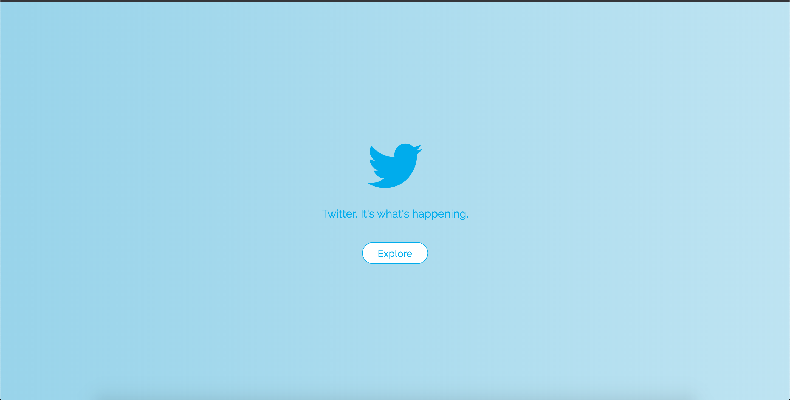
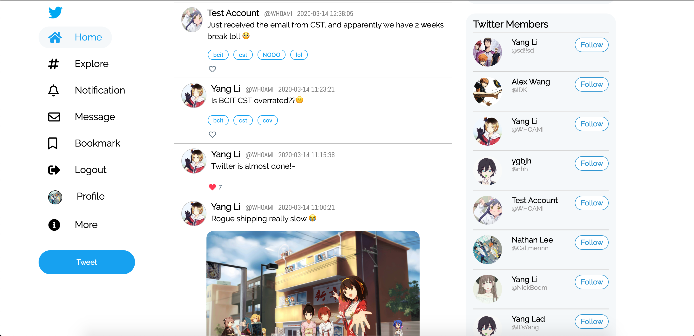
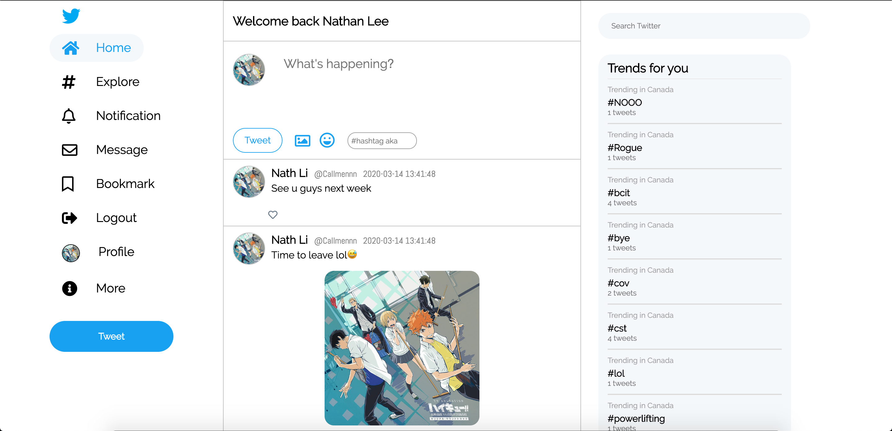
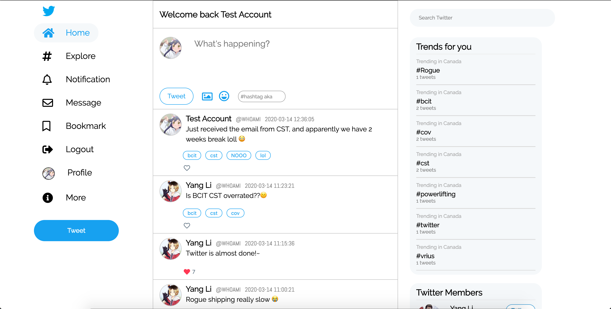
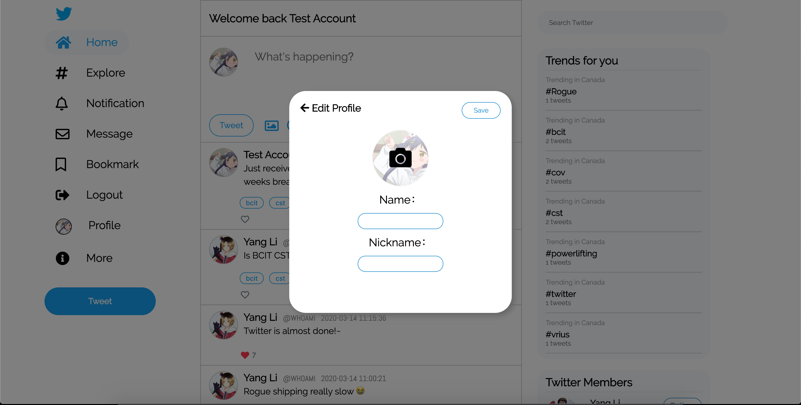
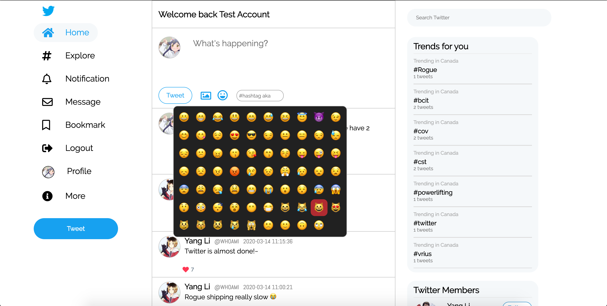
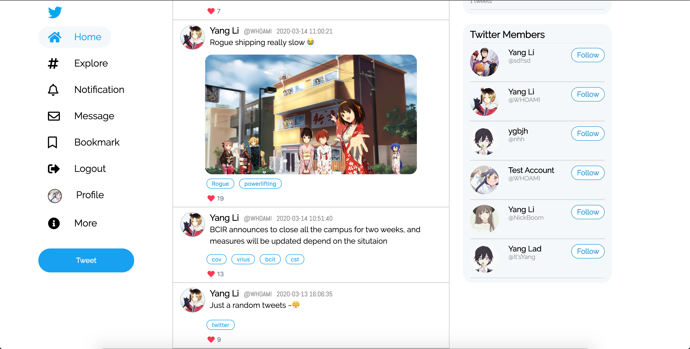

# Twitter

> https://twitter-6f022.web.app

## Table of Contents

- [Introduction](#01)
- [Features](#02)
- [Preview](#03)
- [Technology](#04)
- [Usage](#05)

## Introduction

This app was created when I was learning CSS in term 1, and I want try the offical twitter website layout to sharpen my css skills. However, I was not able to add database and image storage feature because I only know CSS that time. So, I picked up this project and re-design some elements and added more features on to it to make it like a complete web app.

## Features

- Custom your name, nickname and profile picture
- Tweet the news, emoition and everything you want to share
- Realtime tweets read and write
- Upload the image to the app with firebase cloud storage
- Built in Emoji system
- Like tweets
- Hashtag
- Realtime trending board based on hashtag counts, know what is on trending now!
- Friend system shows all the members who joined twitter

## Preview

## Technology

- HTML5/CSS3/Javascript/jQuery
- Firebase: firestore/cloud storage

## Change Log

### v0.0.0 (2020/03/14 16:32) First deploy

- First release version deploy to firebase
